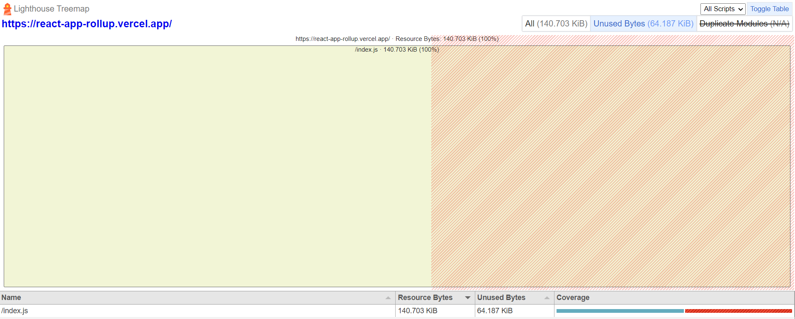
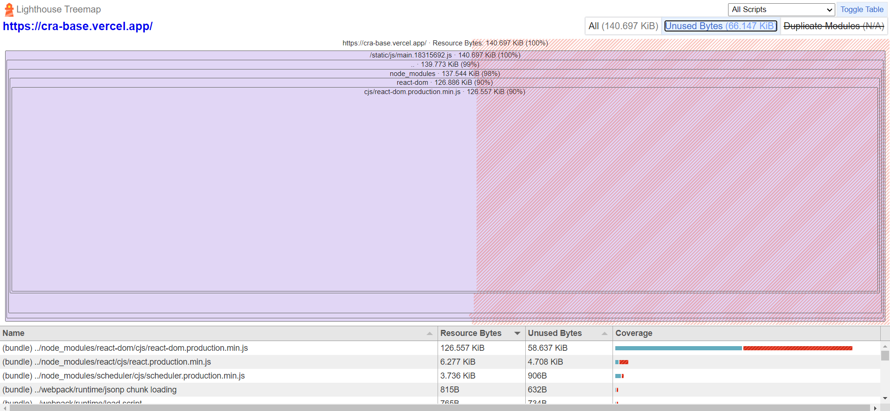

# React App Rollup

A basic React app that uses Rollup as its bundler instead of Webpack. The goal of this experiment is to see how much of the configuration hidden behind Create React App is necessary.

## Conclusions

Create React App is very comfortable, but it gives us an app with a lot of hidden configurations. Most of which, we may not need and without ejecting it can be very hard to customise.

[React App Rollup in production](https://react-app-rollup.vercel.app/)

[Create React App in production](https://cra-base.vercel.app/)

### Metrics





## Getting Started

These instructions will get you a copy of the project up and running on your local machine for development and testing purposes.

### Installing

1. Clone the repository:

```
git clone https://github.com/benjaminrae/react-app-rollup.git
```

2. Navigate to the directory:

```
cd react-app-rollup
```

3. Install the dependencies:

```
npm install
```

4. Start the development server:

```
npm start
```

This will start the development server and open the app in your browser at `http://localhost:3000`.

5. Create a production build:

```
npm run build
```

## Usage

This app serves as a simple example of a React app using Rollup as its bundler. You can use it as a reference for your own projects or as a starting point for a new project.

## Acknowledgments

- [Rollup](https://rollupjs.org/)
- [React](https://reactjs.org/)
- [Create React App](https://github.com/facebook/create-react-app)
